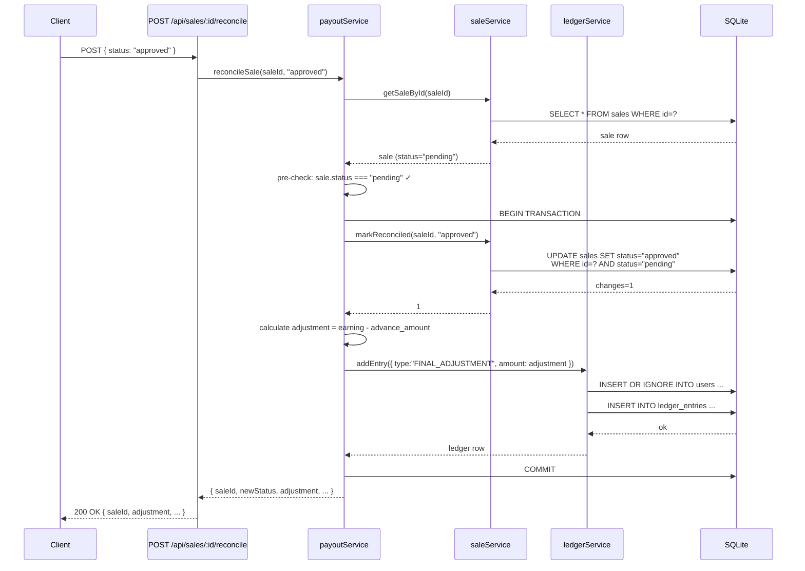

# Low-Level Design — User Payout Management System

## 1. Overview

This system manages affiliate sales payouts for creators/sellers. When a sale is recorded, a seller receives a 10% advance payout immediately (via a triggerable batch job). Once an admin reviews the sale and reconciles it as approved or rejected, the remaining balance is credited (or the advance is clawed back). Sellers can withdraw their available balance, subject to a 24-hour cooldown after a successful withdrawal. All financial state is derived from an append-only ledger — there is no mutable "balance" column anywhere in the schema.

---

## 2. Core Entities

### User
Represents a seller/affiliate in the system.

| Field | Type | Purpose |
|---|---|---|
| `id` | TEXT PK | Externally supplied identifier (e.g. username or UUID from auth layer) |
| `name` | TEXT | Optional display name |
| `created_at` | TEXT | Row creation timestamp |

A user row is created implicitly via `INSERT OR IGNORE` when a sale is created or a ledger entry is written directly — callers never need to manage user rows manually.

### Sale
Represents a single affiliate sale event, the primary entity around which payouts are calculated.

| Field | Purpose |
|---|---|
| `id` | UUID primary key |
| `user_id` | FK → users; whose sale this is |
| `brand` | The brand/product the sale is for |
| `earning` | Gross earning amount for this sale (always positive) |
| `status` | Lifecycle: `pending` → `approved` or `rejected` |
| `advance_paid` | 0/1 flag: has the 10% advance been issued? Used as the idempotency guard column |
| `advance_amount` | Actual advance amount disbursed (stored for reconciliation math) |
| `created_at` | Row creation timestamp |
| `reconciled_at` | Set at reconciliation time; null while status=pending |

### LedgerEntry
The system's immutable financial record. Every credit or debit in the system is one row here — no row is ever updated or deleted.

| Field | Purpose |
|---|---|
| `id` | UUID PK |
| `user_id` | FK → users; whose balance this affects |
| `sale_id` | FK → sales (nullable); present for ADVANCE and FINAL_ADJUSTMENT entries |
| `withdrawal_id` | FK → withdrawals (nullable); present for WITHDRAWAL and REFUND entries |
| `type` | `ADVANCE` \| `FINAL_ADJUSTMENT` \| `WITHDRAWAL` \| `REFUND` |
| `amount` | **Signed real**: positive = credit, negative = debit |
| `note` | Human-readable description for audit trail |
| `created_at` | Immutable timestamp |

A user's balance is always `SELECT COALESCE(SUM(amount), 0) FROM ledger_entries WHERE user_id = ?` — computed, never stored.

### Withdrawal
Represents one withdrawal request from a user.

| Field | Purpose |
|---|---|
| `id` | UUID PK |
| `user_id` | FK → users |
| `amount` | The amount requested (always stored positive; the ledger debit is `-amount`) |
| `status` | `PENDING` → `COMPLETED` \| `FAILED` \| `CANCELLED` \| `REJECTED` |
| `created_at` | Initiation timestamp |
| `settled_at` | Set when status transitions out of PENDING; used for cooldown calculation |

---

## 3. Module Design

Each service module has exactly one responsibility. No module writes to another's "owned" table directly.

### `ledgerService.js` — The accounting engine
**Single responsibility:** The only module allowed to `INSERT` into `ledger_entries`. All other services call `addEntry()` — they never write to the table directly.

```
exports: addEntry, getBalance, getLedgerForUser, hasAdvanceBeenPaid
```

This single-writer invariant means: if there is ever a discrepancy in a user's balance, there is exactly one file to inspect.

### `saleService.js` — Sales CRUD + idempotency guards
**Single responsibility:** Manage the `sales` table. Provides standard CRUD plus two guarded update functions (`markAdvancePaid`, `markReconciled`) that use conditional `WHERE` clauses to prevent double-processing. Returns `result.changes` so callers can detect no-ops.

```
exports: createSale, getSaleById, getSalesByUser, getAllSales,
         getPendingUnadvancedSales, markAdvancePaid, markReconciled
```

### `payoutService.js` — Business math
**Single responsibility:** Knows the advance percentage (10%) and the reconciliation adjustment formulas. Orchestrates calls to `saleService` and `ledgerService` inside `db.transaction()` blocks.

```
exports: ADVANCE_PERCENTAGE, runAdvancePayoutJob, reconcileSale
```

It does not touch the database directly — it only composes the lower-level services.

### `withdrawalService.js` — Withdrawal lifecycle
**Single responsibility:** Manages the `withdrawals` table and the withdrawal lifecycle (initiation, cooldown check, settlement, refund-on-failure). Calls `ledgerService.addEntry()` for all financial effects.

```
exports: WITHDRAWAL_COOLDOWN_HOURS, initiateWithdrawal, settleWithdrawal,
         getLastCompletedWithdrawal, getWithdrawalsByUser
```

**Why this separation?**
- **Single responsibility**: each module has one clear job and one clear owner table.
- **Testability**: services can be unit-tested by importing them directly, without spinning up the HTTP layer.
- **Auditability**: centralising ledger writes in `ledgerService` means there is exactly one call-stack path for every financial write. Tracing a balance discrepancy is a grep for `addEntry(` calls.

---

## 4. Key Workflows

### (a) Advance Payout Job — `payoutService.runAdvancePayoutJob()`

1. `saleService.getPendingUnadvancedSales()` returns all sales where `status='pending' AND advance_paid=0`.
2. For each eligible sale, open a `db.transaction()`:
   - Calculate `advanceAmount = Math.round(sale.earning × 0.10 × 100) / 100`
   - Call `saleService.markAdvancePaid(sale.id, advanceAmount)`:
     - Issues `UPDATE sales SET advance_paid=1, advance_amount=? WHERE id=? AND advance_paid=0`
     - Returns `changes` count
   - If `changes === 0`: sale was already advanced by another caller — **skip** (no ledger write).
   - If `changes === 1`: call `ledgerService.addEntry({ type:'ADVANCE', amount: advanceAmount, ... })`
3. Collect and return results.

**Ledger state for a sale with `earning=40`:**

| Before job | After job |
|---|---|
| (no entries) | `+4.00 ADVANCE` |
| Balance: ₹0 | Balance: ₹4 |

---

### (b) Sale Reconciliation — `payoutService.reconcileSale(saleId, newStatus)`

**Approved path** (`earning=40`, `advance_amount=4`):

1. Pre-check: `sale.status === 'pending'` — throw early if already reconciled.
2. Open `db.transaction()`:
   - `saleService.markReconciled(saleId, 'approved')` → `UPDATE … WHERE status='pending'`
   - If `changes === 0`: throw (race condition caught at DB level).
   - `adjustment = Math.round((40 - 4) × 100) / 100 = 36.00`
   - `ledgerService.addEntry({ type:'FINAL_ADJUSTMENT', amount: 36.00 })`

**Rejected path** (`earning=40`, `advance_amount=4`):

1. Same pre-check.
2. Open `db.transaction()`:
   - `saleService.markReconciled(saleId, 'rejected')`
   - `adjustment = Math.round(-4 × 100) / 100 = -4.00`
   - `ledgerService.addEntry({ type:'FINAL_ADJUSTMENT', amount: -4.00 })`

**Ledger state after both paths:**

| Entry | Approved | Rejected |
|---|---|---|
| ADVANCE | +4.00 | +4.00 |
| FINAL_ADJUSTMENT | +36.00 | −4.00 |
| **Balance** | **₹40.00** | **₹0.00** |

---

### (c) Withdrawal — initiation and settlement

**Initiation** (balance = ₹80):

1. `ledgerService.getBalance(userId)` → 80.
2. Check cooldown: `getLastCompletedWithdrawal()` → no recent COMPLETED withdrawal.
3. Open `db.transaction()`:
   - `INSERT INTO withdrawals … status='PENDING', amount=80`
   - `ledgerService.addEntry({ type:'WITHDRAWAL', amount: -80 })` — optimistic debit.
4. User's balance is now ₹0 immediately.

**Settlement — COMPLETED:**

1. `UPDATE withdrawals SET status='COMPLETED', settled_at=now WHERE id=? AND status='PENDING'`
2. No ledger action — the debit already stands.
3. Balance remains ₹0.

**Settlement — FAILED / CANCELLED / REJECTED:**

1. `UPDATE withdrawals SET status='FAILED', settled_at=now WHERE id=? AND status='PENDING'`
2. `ledgerService.addEntry({ type:'REFUND', amount: +80 })` — credit back.
3. Balance returns to ₹80. User can immediately initiate another withdrawal (no cooldown — only COMPLETED withdrawals start the 24-hour clock).

---

## 5. Idempotency & Concurrency Safety

All state-mutating operations use a **conditional WHERE clause** pattern rather than application-level locks:

```sql
-- Advance payout guard (saleService.markAdvancePaid)
UPDATE sales SET advance_paid=1, advance_amount=?
WHERE id = ? AND advance_paid = 0

-- Reconciliation guard (saleService.markReconciled)
UPDATE sales SET status=?, reconciled_at=datetime('now')
WHERE id = ? AND status = 'pending'

-- Settlement guard (withdrawalService.settleWithdrawal)
UPDATE withdrawals SET status=?, settled_at=datetime('now')
WHERE id = ? AND status = 'PENDING'
```

**Why this is safe:** `better-sqlite3` is synchronous and SQLite serialises all writes. There is no possibility of two concurrent threads interleaving inside a single `db.transaction()` block — the transaction either commits atomically or rolls back entirely. If two callers race to advance the same sale, one will get `changes=1` (success) and the other will get `changes=0` (no-op). The service layer surfaces the `changes` count to the caller, which can then return a `409 Conflict` or skip cleanly.

This eliminates the need for any external lock service or advisory locking mechanism at this scale.

---

## 6. Reconciliation Sequence Diagram



---

## 7. Terminology Clarification — "Final Payout = ₹68"

The assignment's worked example (3 sales, `earning=40` each, one rejected + two approved) states a "Final Payout" of **₹68**.

This figure refers specifically to the **sum of `FINAL_ADJUSTMENT` ledger entries at reconciliation time**, not the user's total balance:

```
Reconciliation adjustments only:
  Sale 1 (rejected): −4.00   (claw back the advance)
  Sale 2 (approved): +36.00  (earning 40 − advance 4)
  Sale 3 (approved): +36.00
  ─────────────────────────
  Sum of FINAL_ADJUSTMENTs: +68.00  ← the assignment's "₹68"

Full ledger (advances + adjustments):
  3 × ADVANCE entries:        +12.00
  FINAL_ADJUSTMENTs:          +68.00
  ─────────────────────────────────
  True total balance:          ₹80.00
```

Both numbers are verifiable in test 7 of `backend/tests/payoutSystem.test.js`, which asserts:
- `finalAdjustmentTotal === 68` (the assignment's stated figure)
- `ledgerService.getBalance('john_doe') === 80` (the true spendable balance)
