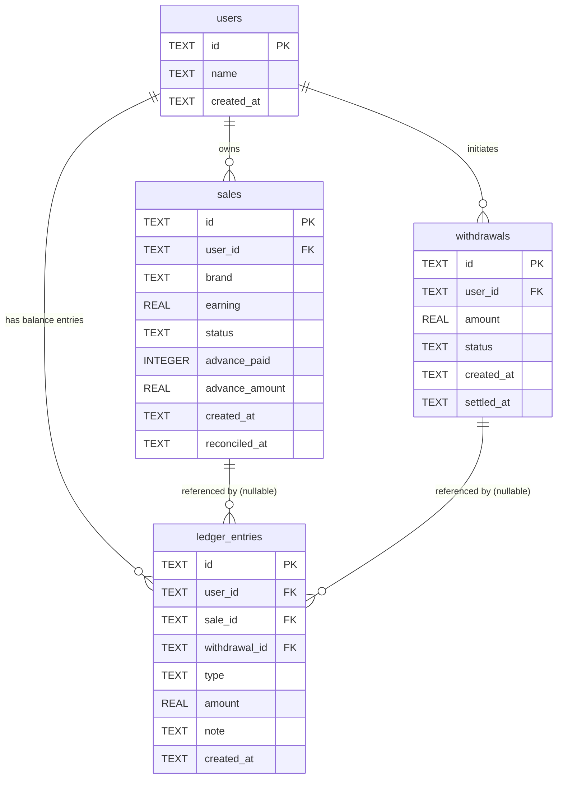

# Database Schema — User Payout Management System

## Tables

### `users`

| Column | Type | Constraints | Purpose |
|---|---|---|---|
| `id` | TEXT | PRIMARY KEY | Externally supplied identifier |
| `name` | TEXT | — | Optional display name |
| `created_at` | TEXT | NOT NULL, DEFAULT CURRENT_TIMESTAMP | Row creation time |

---

### `sales`

| Column | Type | Constraints | Purpose |
|---|---|---|---|
| `id` | TEXT | PRIMARY KEY | UUID |
| `user_id` | TEXT | NOT NULL, FK → users(id) | Sale owner |
| `brand` | TEXT | NOT NULL | Brand/product name |
| `earning` | REAL | NOT NULL | Gross earning (always positive) |
| `status` | TEXT | NOT NULL, DEFAULT 'pending', CHECK IN ('pending','approved','rejected') | Lifecycle state |
| `advance_paid` | INTEGER | NOT NULL, DEFAULT 0 | Idempotency flag: 0 = not yet advanced, 1 = advance issued |
| `advance_amount` | REAL | NOT NULL, DEFAULT 0 | Advance amount actually disbursed (used in reconciliation math) |
| `created_at` | TEXT | NOT NULL, DEFAULT CURRENT_TIMESTAMP | Row creation time |
| `reconciled_at` | TEXT | — (nullable) | Set when status transitions from pending |

---

### `withdrawals`

| Column | Type | Constraints | Purpose |
|---|---|---|---|
| `id` | TEXT | PRIMARY KEY | UUID |
| `user_id` | TEXT | NOT NULL, FK → users(id) | Withdrawal owner |
| `amount` | REAL | NOT NULL | Amount requested (stored positive; ledger debit is −amount) |
| `status` | TEXT | NOT NULL, DEFAULT 'PENDING', CHECK IN ('PENDING','COMPLETED','FAILED','CANCELLED','REJECTED') | Lifecycle state |
| `created_at` | TEXT | NOT NULL, DEFAULT CURRENT_TIMESTAMP | Initiation time |
| `settled_at` | TEXT | — (nullable) | Set on transition out of PENDING; used for 24-hour cooldown check |

---

### `ledger_entries`

| Column | Type | Constraints | Purpose |
|---|---|---|---|
| `id` | TEXT | PRIMARY KEY | UUID |
| `user_id` | TEXT | NOT NULL, FK → users(id) | Balance owner |
| `sale_id` | TEXT | FK → sales(id), nullable | Present for ADVANCE and FINAL_ADJUSTMENT entries |
| `withdrawal_id` | TEXT | FK → withdrawals(id), nullable | Present for WITHDRAWAL and REFUND entries |
| `type` | TEXT | NOT NULL, CHECK IN ('ADVANCE','FINAL_ADJUSTMENT','WITHDRAWAL','REFUND') | Entry classification |
| `amount` | REAL | NOT NULL | **Signed**: positive = credit, negative = debit |
| `note` | TEXT | — | Human-readable audit note |
| `created_at` | TEXT | NOT NULL, DEFAULT CURRENT_TIMESTAMP | Immutable write time |

> **Append-only invariant:** rows in `ledger_entries` are never updated or deleted. A user's balance is always computed as `SELECT COALESCE(SUM(amount), 0) FROM ledger_entries WHERE user_id = ?`.

---

## Entity-Relationship Diagram

---

## Indexes

### `idx_sales_user_status` — `ON sales(user_id, status)`

Optimises the two most frequent sales queries:
- `GET /api/sales?userId=` → `WHERE user_id = ? ORDER BY created_at DESC`
- `getPendingUnadvancedSales()` → `WHERE status = 'pending' AND advance_paid = 0`

The composite `(user_id, status)` index allows SQLite to seek directly to a user's pending sales without a full table scan, which matters when the advance batch job runs across many users.

### `idx_ledger_user` — `ON ledger_entries(user_id)`

Optimises the two core ledger queries:
- `getBalance(userId)` → `SELECT SUM(amount) … WHERE user_id = ?`
- `getLedgerForUser(userId)` → `SELECT * … WHERE user_id = ? ORDER BY created_at ASC`

Since balance is computed on every read (no cached column), an index on `user_id` is critical — without it, every balance call would scan the entire ledger table.

### `idx_withdrawals_user_status` — `ON withdrawals(user_id, status)`

Optimises:
- `getWithdrawalsByUser(userId)` → `WHERE user_id = ?`
- `getLastCompletedWithdrawal(userId)` → `WHERE user_id = ? AND status = 'COMPLETED' ORDER BY settled_at DESC LIMIT 1`

The `status` column in the index allows the cooldown check (which filters specifically for `COMPLETED` rows) to avoid scanning all withdrawals for a user.
